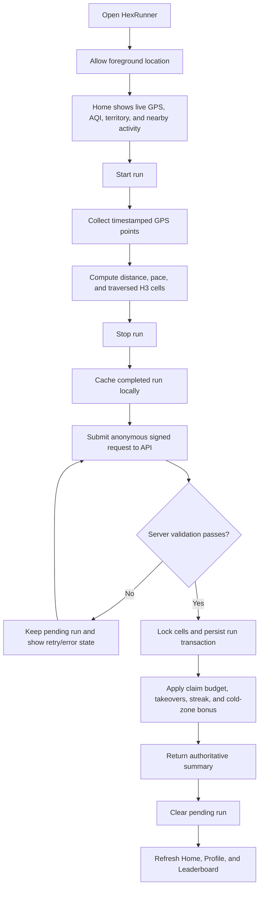
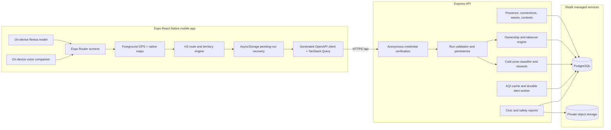
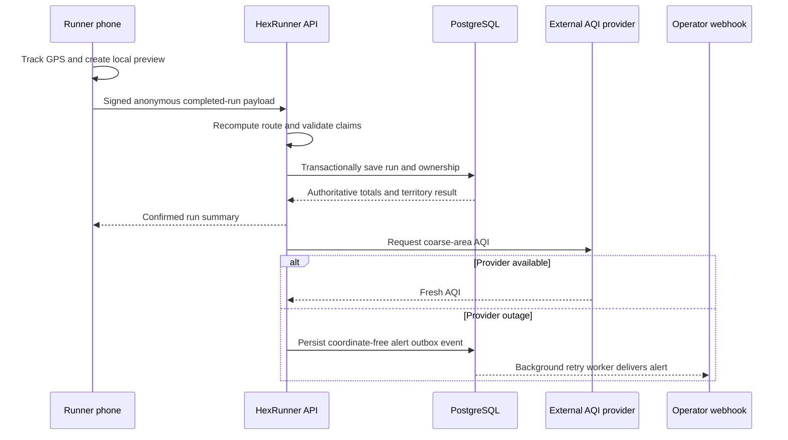

# HexRunner

<div align="center">

**Run. Claim your hex. Defend your ground.**

A privacy-conscious, phone-first GPS fitness game where real-world movement
captures H3 territory, powers live social play, and rewards exploration beyond
the most popular routes.

Built for the **iQOO Hackathon 2026** with Expo, React Native, Express,
PostgreSQL, Drizzle ORM, and Uber H3.

[Features](#features) · [How it works](#how-hexrunner-works) ·
[Architecture](#system-architecture) · [Setup](#local-setup) ·
[Validation](#validation-and-ci)

</div>

---

## Product overview

HexRunner turns a walk or run into a territory game. The mobile app records a
runner's foreground GPS path, converts the route into uniform H3 resolution-9
cells, and sends the completed activity to an authoritative API. The server
validates the route, applies a fitness-aware daily claim budget, awards cold-zone
bonuses, and atomically updates territory ownership.

The result is a fitness loop with visible progress:

1. **Move** through the real world.
2. **Claim** unowned hexes.
3. **Take over** territory from other runners.
4. **Explore** less active areas for equitable bonus rewards.
5. **Return** to defend territory, improve streaks, and climb the leaderboard.


## Features

### GPS running and territory

- Foreground GPS run tracking with elapsed time, distance, pace, and route
  points.
- Uniform Uber H3 resolution-9 territory instead of arbitrary route polygons.
- Server-authoritative new claims and takeovers.
- A seven-day ownership freshness model for territory visualization.
- Crash-safe local pending-run storage and retry until the API confirms the
  save.
- Advisory anti-spoof checks for sustained vehicle speed and impossible GPS
  jumps.

### On-device fitness intelligence

- A compact `4 → 8 → 4` neural network predicts one of four fitness tiers:
  Beginner, Casual, Regular, or Trained.
- Inference runs locally with committed weights—no hosted AI API is required.
- Input features include average pace, average distance, recent-run frequency,
  and self-reported activity level.
- The tier creates a fair daily territory target:

| Fitness tier | Daily claim target |
| ------------ | -----------------: |
| Beginner     |            6 hexes |
| Casual       |           10 hexes |
| Regular      |           15 hexes |
| Trained      |           20 hexes |

This classifier is advisory fitness gamification, not a medical assessment.

### Cold-zone equity rewards

- Server-authoritative bonuses encourage runners to explore areas with lower
  historical activity.
- City/day baselines are frozen after evaluation so rewards cannot shift during
  the day.
- Privacy-preserving HMAC-derived contribution keys prevent the equity dataset
  from becoming an identity trail.
- Replay protection, server-derived path checks, and daily bonus caps prevent
  duplicate reward claims.

### Live social play

- Short-lived, privacy-conscious nearby-runner presence.
- Connection requests, accepts, rejects, blocks, and disconnects.
- Friendly wave interactions and live territory contests.
- Ephemeral capability grants prevent stale clients from performing actions
  after permissions have changed.
- Discovery anchors are isolated from completed run history and exact location
  is not exposed to nearby runners.

### Air quality and civic awareness

- Coarse-area AQI data with fresh, stale-fallback, and recovery states.
- Durable operator-notification outbox for sustained AQI provider outages.
- Bounded exponential retry, multi-instance leases, ordered
  trigger-before-resolution delivery, visible exhaustion, and 30-day terminal
  history retention.
- Civic and safety reporting with coarse location and private object storage for
  supporting photos.

### On-device voice companion

- Consent-based spoken run guidance powered by `expo-speech`.
- Uses authoritative run confirmations rather than optimistic UI events.
- Rejects stale asynchronous context so delayed announcements do not describe
  an old run state.
- Runs locally on the device without sending voice content to an external AI
  service.

## How HexRunner works

### End-to-end runner workflow



### Run-saving workflow

1. The phone creates an anonymous device credential and stores it securely.
2. During a run, the app records timestamped points and computes a local preview
   of distance, pace, anti-spoof advisories, and traversed cells.
3. When the runner stops, the complete payload is saved to local storage before
   upload. Closing the app does not silently discard the activity.
4. The API verifies the anonymous credential, chronology, coordinate bounds,
   run window, and claim consistency.
5. The server recomputes claim eligibility from the submitted path rather than
   trusting client totals.
6. Requested cells are locked in deterministic order. The run, route points,
   ownership changes, and takeover events are committed atomically.
7. The response becomes the source of truth for the summary, profile totals,
   leaderboard, streak, and voice announcements.

### Territory rules

- **New claim:** a valid run crosses an eligible unowned H3 cell.
- **Takeover:** a newer completed run crosses a cell owned by another runner.
- **No duplicate inflation:** repeated points in the same cell do not create
  repeated claims.
- **Daily fairness:** the server enforces the daily target associated with the
  runner's locally predicted fitness tier.
- **Authoritative result:** mobile calculations are previews; the API decides
  persisted ownership and rewards.

## System architecture



### Data and trust boundaries



### Key trust decisions

- The **phone is trusted for interaction, not authority**. It presents previews,
  but ownership and rewards are server-derived.
- Anonymous credentials identify an enrolled installation without introducing a
  social login dependency.
- Exact run coordinates belong to the saved activity flow and are never copied
  into AQI alert delivery rows.
- Nearby presence and interaction grants are short-lived and separated from
  durable run identity.
- Cold-zone aggregate keys are purpose-built and unlinkable to public runner
  identity.

## Technology stack

| Layer             | Technology                                                |
| ----------------- | --------------------------------------------------------- |
| Mobile            | Expo 54, React Native 0.81, TypeScript, Expo Router       |
| Maps and location | `react-native-maps`, `expo-location`, `h3-js`             |
| Client data       | TanStack Query, generated OpenAPI/Zod clients             |
| Local persistence | AsyncStorage and Expo SecureStore                         |
| Voice             | `expo-speech`                                             |
| API               | Express 5, TypeScript, Pino                               |
| Database          | PostgreSQL, Drizzle ORM                                   |
| Object storage    | Replit private object storage                             |
| Validation        | TypeScript, Node test runner, project integration scripts |
| Workspace         | pnpm monorepo                                             |

## Repository structure

```text
.
├── artifacts/
│   ├── hexrunner/                 # Expo React Native app
│   │   ├── src/screens/           # Home, Run, Leaderboard, Profile, onboarding
│   │   ├── src/services/          # GPS, H3, recovery, social, AI, voice
│   │   ├── src/models/            # Committed on-device model weights
│   │   ├── scripts/               # Mobile validation and model training
│   │   └── docs/                  # Judge and feature evidence
│   ├── api-server/                # Express API and background workers
│   │   ├── src/routes/            # HTTP endpoints
│   │   ├── src/lib/               # Domain logic and durable workers
│   │   ├── src/tests/             # Database-backed integration tests
│   │   └── scripts/               # Bundled validation entry points
│   └── mockup-sandbox/            # Design preview artifact
├── lib/
│   ├── api-spec/                  # OpenAPI contract and generated API types
│   ├── api-client-react/          # React client package
│   ├── api-zod/                   # Runtime request/response schemas
│   └── db/                        # Drizzle schema and PostgreSQL access
├── screenshots/                   # Repository-safe product screenshots
├── .github/workflows/ci.yml       # GitHub validation workflow
├── pnpm-workspace.yaml
└── package.json
```

## Local setup

### Prerequisites

- Node.js 24
- pnpm 10
- PostgreSQL
- Expo Go on an Android/iQOO device for real GPS and native-map testing

### 1. Clone and install

```bash
git clone https://github.com/adityarajgupta154/HexRunner.git
cd HexRunner
corepack enable
pnpm install --frozen-lockfile
```

### 2. Configure environment variables

Create secrets through Replit Secrets or your local secret manager. Never commit
their values.

| Variable                                 | Required         | Purpose                                      |
| ---------------------------------------- | ---------------- | -------------------------------------------- |
| `DATABASE_URL`                           | Yes              | PostgreSQL connection string                 |
| `SESSION_SECRET`                         | Yes              | Anonymous credential and privacy-key signing |
| `PRIVATE_OBJECT_DIR`                     | For civic photos | Private object-storage directory             |
| `PORT`                                   | At runtime       | Service listening port                       |
| `AIR_QUALITY_OPERATOR_ALERT_WEBHOOK_URL` | Optional         | HTTPS operator alert destination             |
| `LOG_LEVEL`                              | Optional         | Pino logging level                           |

Replit injects its development and artifact routing variables automatically.

### 3. Apply the database schema

```bash
pnpm --filter @workspace/db run push
```

### 4. Start the project

On Replit, start the existing managed workflows:

- `artifacts/api-server: API Server`
- `artifacts/hexrunner: expo`

Equivalent package commands:

```bash
# API
PORT=8080 pnpm --filter @workspace/api-server run dev

# Expo / Metro
PORT=19292 pnpm --filter @workspace/hexrunner run dev
```

Scan the Expo QR code with Expo Go and grant foreground location permission.
Browser preview is useful for navigation and save-flow checks, but native maps,
speech, and real GPS capture must be tested on a physical phone.

## API responsibilities

The Express API is mounted under `/api` and provides:

- anonymous enrollment and credential verification;
- run validation and transactional save;
- H3 ownership lookup and takeover history;
- users, profile statistics, recent runs, and leaderboard;
- live presence, discovery, connections, waves, and territory contests;
- AQI lookup, stale fallback, and operator-outage delivery;
- civic/safety reports and private photo handling;
- cold-zone evaluation and bonus settlement;
- health checks for deployment.

The OpenAPI contract and generated clients keep mobile/API payloads aligned.

## Reliability and privacy

### Completed-run recovery

A stopped run is written locally before upload. Failed requests keep the run in
a retryable state, and startup recovery can resume a previously interrupted
save. The UI does not enable the final “Done” path until the API confirms
persistence.

### AQI outage delivery

Sustained provider outages and their matching recoveries are persisted in a
coordinate-free PostgreSQL outbox. Workers use:

- deterministic notification IDs;
- `FOR UPDATE SKIP LOCKED` claims;
- tokenized, expiring leases;
- bounded exponential backoff;
- strict trigger-before-resolution ordering;
- stale-completion no-ops after lease reclaim;
- visible exhausted/discarded terminal states;
- 30-day terminal-history retention in bounded cleanup batches.

### Location privacy

- AQI caching uses coarse areas rather than exact runner coordinates.
- AQI alert history stores no runner identity, latitude, longitude, or route.
- Live discovery uses ephemeral presence and continuity records.
- Cold-zone aggregation uses privacy-specific derived keys.
- Civic photos are stored privately and referenced through controlled API
  flows.

## Validation and CI

GitHub Actions runs typechecks and the full server/mobile validation matrix
against an ephemeral PostgreSQL service on pushes and pull requests.

Run the same checks locally:

```bash
pnpm run typecheck:libs
pnpm --filter @workspace/api-server run typecheck
pnpm --filter @workspace/hexrunner run typecheck

pnpm --filter @workspace/api-server run validate:air-quality
pnpm --filter @workspace/api-server run validate:run-saving
pnpm --filter @workspace/api-server run validate:cold-zones
pnpm --filter @workspace/api-server run validate:live-presence
pnpm --filter @workspace/api-server run validate:live-interactions

pnpm --filter @workspace/hexrunner run validate:models
pnpm --filter @workspace/hexrunner run validate:hex-engine
pnpm --filter @workspace/hexrunner run validate:cold-zones
pnpm --filter @workspace/hexrunner run validate:live-presence
pnpm --filter @workspace/hexrunner run validate:live-interactions
pnpm --filter @workspace/hexrunner run validate:voice-companion
```

The database-backed validators create isolated fixtures and remove their own
rows.

## On-device model provenance

`artifacts/hexrunner/scripts/train_fitness_model.py` creates a deterministic,
balanced 500-row synthetic dataset and trains the small fitness classifier.
Weights are exported to:

```text
artifacts/hexrunner/src/models/fitnessWeights.json
```

Inference in `fitnessModel.ts` performs normalization, dense matrix
multiplication, ReLU, and softmax using plain TypeScript. The Colab-ready
notebook is:

```text
artifacts/hexrunner/scripts/hexrunner_fitness_colab.ipynb
```

## Demo checklist

1. Open HexRunner on a physical Android/iQOO phone.
2. Allow foreground location and confirm the live map, AQI, and H3 grid.
3. Start a run and move through multiple cells.
4. Stop and wait for the authoritative saved confirmation.
5. Review distance, duration, pace, new claims, takeovers, bonus, and streak.
6. Open Home to see updated territory.
7. Open Leaderboard and Profile to confirm shared persisted totals.
8. Optionally demonstrate a nearby connection, wave, or territory contest with
   a second device.

The detailed judge-evidence guide is available at
`artifacts/hexrunner/docs/JUDGE_EVIDENCE.md`.

## Contributing

1. Create a focused branch from `main`.
2. Keep mobile previews separate from server-authoritative decisions.
3. Add integration coverage for database or concurrency behavior.
4. Run the validation matrix above.
5. Open a pull request with behavior, privacy, and migration notes.

## License

This project is released under the [MIT License](LICENSE).
