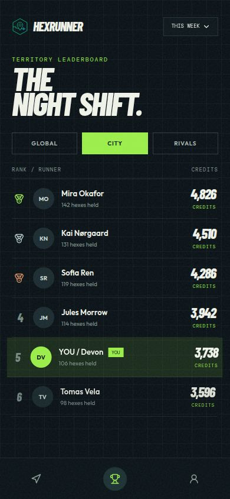
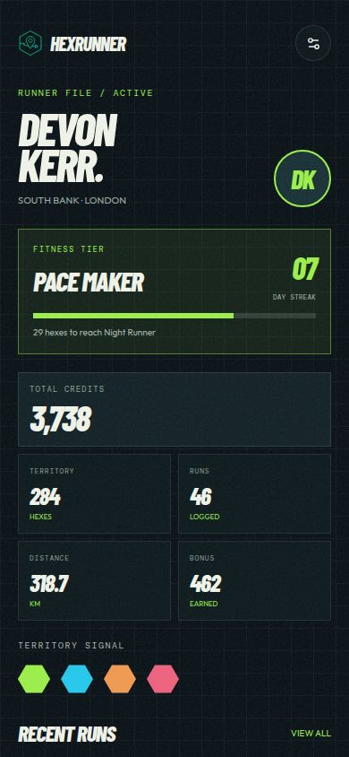
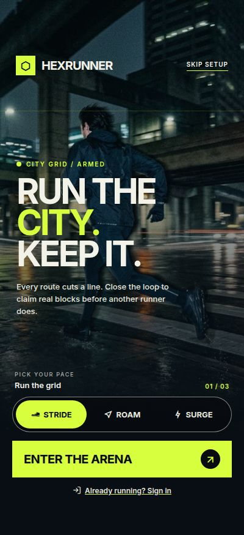
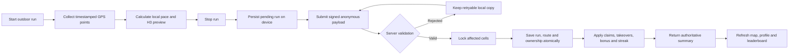
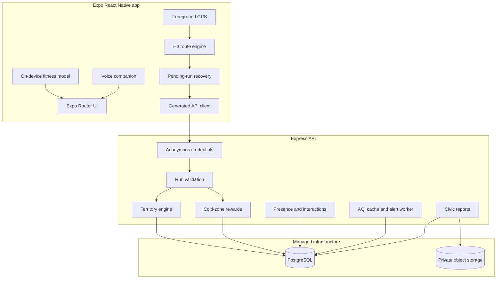

# HexRunner

<div align="center">


### Run the streets. Claim the grid. Own your city.

**HexRunner transforms real-world runs into a live territory game.**  
Every route crosses H3 cells, every valid run changes the map, and every
neighbourhood becomes an arena worth exploring.

<br />

[](https://expo.dev/)
[](https://reactnative.dev/)
[](https://www.typescriptlang.org/)
[](https://www.postgresql.org/)
[](https://h3geo.org/)

Built for the **iQOO Hackathon 2026**

[Experience](#the-experience) · [Features](#what-makes-hexrunner-different) ·
[Architecture](#system-architecture) · [Setup](#run-it-locally) ·
[Validation](#validation-and-ci)

</div>

---

## The big idea

Most running apps record where you went. **HexRunner gives every kilometre a
consequence.**

The world is divided into consistent H3 hexagons. When a runner completes a
valid route, HexRunner converts that movement into territory claims,
takeovers, streak progress, exploration bonuses, and leaderboard movement.
The phone creates the experience; the server decides the truth.

| Move | Claim | Compete | Explore | Return |
| :---: | :---: | :-----: | :-----: | :----: |
| Run or walk outdoors | Cross cells to capture them | Challenge nearby ownership | Find quieter cold zones | Defend territory and build streaks |

> **The core loop:** move through the real world → cross hexes → save the run →
> receive an authoritative result → watch the city change.

## The experience

<table>
  <tr>
    <td width="50%">
      
    </td>
    <td width="50%">
      
    </td>
  </tr>
  <tr>
    <td align="center"><strong>Live territory</strong><br/>See your city as a playable grid.</td>
    <td align="center"><strong>Competitive momentum</strong><br/>Turn consistent movement into rank.</td>
  </tr>
  <tr>
    <td width="50%">
      
    </td>
    <td width="50%">
      
    </td>
  </tr>
  <tr>
    <td align="center"><strong>Progress that feels owned</strong><br/>Claims, pace, streaks, and identity in one place.</td>
    <td align="center"><strong>A cinematic first run</strong><br/>Learn the game before entering the arena.</td>
  </tr>
</table>

The companion marketing experience tells the same story on the web through a
rotating globe, pinned scroll scenes, rounded card transitions, gameplay
videos, and responsive mobile layouts.

<p align="center">
  
</p>

## What makes HexRunner different

### 1. A city-sized territory board

- Real routes are converted into **Uber H3 resolution-9 cells**.
- Unowned cells become new claims.
- Opponent-owned cells can become takeovers.
- Repeated points inside one cell never inflate a result.
- Territory freshness keeps the map active instead of permanently locked.

### 2. Server-authoritative competition

Mobile calculations are previews, not final scores. The API independently
validates chronology, coordinate bounds, route consistency, traversed cells,
claim limits, and takeover eligibility before changing ownership.

This protects the competitive loop from optimistic UI errors, duplicate
submissions, and basic GPS manipulation.

### 3. Fitness-aware fairness

A compact on-device `4 → 8 → 4` neural network classifies a runner into a
lightweight fitness tier using recent behaviour and self-reported activity.
No hosted AI service is required.

| Fitness tier | Daily territory target |
| :----------- | ---------------------: |
| Beginner | 6 hexes |
| Casual | 10 hexes |
| Regular | 15 hexes |
| Trained | 20 hexes |

The model is an advisory game mechanic—not a medical assessment.

### 4. Cold-zone exploration rewards

Popular routes should not be the only winning strategy. HexRunner rewards
movement through historically quieter areas using frozen city/day baselines,
server-derived path checks, replay protection, and bounded daily bonuses.

### 5. Privacy-conscious live play

- Discover nearby runners without exposing exact coordinates.
- Send connection requests and friendly waves.
- Start short-lived territory contests.
- Expire presence, capabilities, and interaction grants quickly.
- Keep discovery continuity separate from durable run history.

### 6. Reliable completed-run recovery

A finished run is stored locally **before** upload. If the network disappears,
the activity remains pending and can be retried. The final summary, streak,
territory, and voice guidance update only after the API confirms persistence.

### 7. Civic awareness built into movement

HexRunner combines coarse-area air-quality information with private civic and
safety reporting. Provider outages use a durable PostgreSQL outbox with
bounded retry, expiring leases, terminal classification, and coordinate-free
operator notifications.

### 8. An on-device voice companion

Consent-based guidance uses `expo-speech` and authoritative run events. Stale
asynchronous announcements are rejected so the voice never celebrates an old
or unconfirmed state.

## How a run becomes territory



### Territory rules at a glance

| Rule | Outcome |
| :--- | :--- |
| Cross an eligible unowned cell | Claim it |
| Cross a valid opponent-owned cell | Take it over |
| Re-enter the same cell repeatedly | Count it once |
| Exceed the daily fitness-aware target | Preserve the run, cap new claims |
| Submit a duplicate or replayed result | Reject additional rewards |
| Receive no authoritative confirmation | Keep the run pending |

## System architecture



### Trust boundaries

| Component | Trusted for | Not trusted for |
| :--- | :--- | :--- |
| Mobile app | Interaction, local previews, recovery | Final ownership or rewards |
| API | Validation, limits, authoritative outcomes | Exposing precise presence locations |
| PostgreSQL | Durable runs, territory, outbox state | Public client access |
| Object storage | Private report attachments | Serving unrestricted public files |

## Technology stack

| Layer | Technology |
| :--- | :--- |
| Mobile | Expo 54, React Native 0.81, Expo Router, TypeScript |
| Maps and location | `react-native-maps`, `expo-location`, `h3-js` |
| Client state | TanStack Query, generated OpenAPI and Zod clients |
| Device storage | AsyncStorage, Expo SecureStore |
| Voice | `expo-speech` |
| API | Express 5, TypeScript, Pino |
| Database | PostgreSQL, Drizzle ORM |
| Media storage | Replit private object storage |
| Web experience | React, Vite, Framer Motion, WebGL |
| Workspace | pnpm monorepo |

## Repository map

```text
HexRunner/
├── artifacts/
│   ├── hexrunner/               # Expo mobile game
│   │   ├── src/screens/         # Home, Run, Leaderboard, Profile
│   │   ├── src/services/        # GPS, H3, social, recovery, voice
│   │   ├── src/models/          # Committed on-device model weights
│   │   └── docs/                # Judge and feature evidence
│   ├── api-server/              # Express API and background workers
│   ├── hexrunner-web/           # Cinematic marketing website
│   └── hexrunner-sih-2026/      # SIH presentation artifact
├── lib/
│   ├── api-spec/                # OpenAPI source of truth
│   ├── api-client-react/        # Generated React client
│   ├── api-zod/                 # Runtime schemas
│   └── db/                      # Drizzle schema and database access
├── screenshots/                 # README and product visuals
├── .github/workflows/ci.yml     # Validation workflow
└── pnpm-workspace.yaml
```

## Run it locally

### Prerequisites

- Node.js 24
- pnpm 10
- PostgreSQL
- Expo Go on an Android/iQOO device for native GPS and map testing

### 1. Clone and install

```bash
git clone https://github.com/adityarajgupta154/HexRunner.git
cd HexRunner
corepack enable
pnpm install --frozen-lockfile
```

### 2. Configure secrets

Use Replit Secrets or a local secret manager. Never commit secret values.

| Variable | Required | Purpose |
| :--- | :---: | :--- |
| `DATABASE_URL` | Yes | PostgreSQL connection |
| `SESSION_SECRET` | Yes | Anonymous credentials and privacy-key signing |
| `PRIVATE_OBJECT_DIR` | Civic photos | Private attachment directory |
| `PORT` | Runtime | Service listening port |
| `AIR_QUALITY_OPERATOR_ALERT_WEBHOOK_URL` | Optional | Operator outage notifications |
| `LOG_LEVEL` | Optional | Server logging level |

### 3. Apply the database schema

```bash
pnpm --filter @workspace/db run push
```

### 4. Start the API and mobile app

```bash
# API
PORT=8080 pnpm --filter @workspace/api-server run dev

# Expo / Metro
PORT=19292 pnpm --filter @workspace/hexrunner run dev
```

On Replit, use the existing managed API and Expo workflows instead. Browser
preview is useful for navigation and save-flow checks; native maps, speech, and
real GPS capture should be tested on a physical phone.

## Validation and CI

GitHub Actions runs TypeScript checks and the server/mobile validation matrix
against an ephemeral PostgreSQL service.

```bash
# Shared contracts
pnpm run typecheck:libs

# API and mobile typechecks
pnpm --filter @workspace/api-server run typecheck
pnpm --filter @workspace/hexrunner run typecheck

# Server-authoritative feature suites
pnpm --filter @workspace/api-server run validate:air-quality
pnpm --filter @workspace/api-server run validate:run-saving
pnpm --filter @workspace/api-server run validate:cold-zones
pnpm --filter @workspace/api-server run validate:live-presence
pnpm --filter @workspace/api-server run validate:live-interactions

# On-device and cross-platform suites
pnpm --filter @workspace/hexrunner run validate:models
pnpm --filter @workspace/hexrunner run validate:hex-engine
pnpm --filter @workspace/hexrunner run validate:cold-zones
pnpm --filter @workspace/hexrunner run validate:live-presence
pnpm --filter @workspace/hexrunner run validate:live-interactions
pnpm --filter @workspace/hexrunner run validate:voice-companion
```

Database-backed validators create isolated fixtures and remove their own rows.

## Demo route

1. Launch HexRunner on a physical Android/iQOO phone.
2. Complete the cinematic onboarding and choose a territory colour.
3. Allow foreground location and confirm the live H3 grid.
4. Start a run and cross multiple cells.
5. Stop and wait for the authoritative saved confirmation.
6. Review distance, duration, pace, claims, takeovers, bonus, and streak.
7. Return Home to see the updated city.
8. Open Leaderboard and Profile to verify persisted progress.
9. Optionally connect a second device for waves and a territory contest.

Detailed judge evidence is available in
[`artifacts/hexrunner/docs/JUDGE_EVIDENCE.md`](artifacts/hexrunner/docs/JUDGE_EVIDENCE.md).

## Design principles

- **Movement first:** the player should understand the next physical action.
- **High contrast:** dark urban surfaces, bright territory colour, clear status.
- **Authority is visible:** pending, rejected, and confirmed outcomes are never
  silently merged.
- **Privacy by structure:** precise movement data does not leak into discovery,
  AQI alerts, or public identity.
- **Failure is recoverable:** network loss should pause progress, not erase it.

## Contributing

1. Branch from `main`.
2. Keep mobile previews separate from server-authoritative decisions.
3. Add integration coverage for database or concurrency changes.
4. Run the relevant validation suites.
5. Open a pull request with behaviour, privacy, and migration notes.

## License

Released under the [MIT License](LICENSE).

---

<div align="center">

### The city is already divided. Start running.

**HexRunner — claim your city, one hex at a time.**

</div>